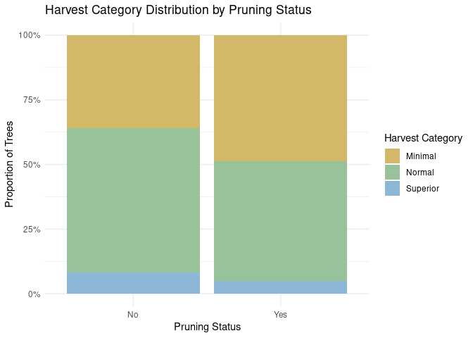

Final Project
================
Gracie Kay
2025-12-06

- [Abstract](#abstract)
- [Background](#background)
- [Question, Hypothesis, Test](#question-hypothesis-test)
  - [Question:](#question)
  - [Hypothesis:](#hypothesis)
  - [Prediction:](#prediction)
  - [Test:](#test)
- [Methods](#methods)
  - [Load and Prepare Data](#load-and-prepare-data)
  - [First Analysis: Stacked Proportional Bar
    Chart](#first-analysis-stacked-proportional-bar-chart)
  - [Second analysis: Chi-square Test](#second-analysis-chi-square-test)
- [Results](#results)
- [Discussion](#discussion)
- [Conclusion](#conclusion)
- [References](#references)

# Abstract

Pruning is widely recommended to improve fruit production in apple
trees, yet its effectiveness can vary across environmental conditions
and management practices. In this project, we analyzed data from the
Wasatch Back Fruit Tree Project to test whether pruning was associated
with higher categorical fruit yield ratings, Minimal, Normal, or
Superior, among 144 apple trees. We visualized the distribution of yield
categories using a stacked proportional bar chart and statistically
evaluated the relationship between pruning and yield using a Chi-square
test of independence, supported by Fisher’s Exact Test. Both analyses
showed no significant association between pruning and harvest ratings,
indicating that pruned trees did not produce higher categorical yields
than unpruned trees in this data set. These results suggest that factors
beyond pruning such as elevation, environmental variability, and
subjective yield reporting may play a larger role in determining fruit
production, highlighting the need for multi-year, standardized
monitoring.

# Background

Fruit production in apple trees is influenced by both genetic and
environmental factors, including nutrient availability, disease
pressure, and canopy structure. One widespread horticultural practice
used to improve fruit yield is pruning, which reduces excess branches,
increases light penetration, and improves airflow within the canopy.
Increased light exposure enhances photosynthetic efficiency in
developing fruiting spurs, which can increase total yield or improve
fruit quality (Costa et al., 2015). Because pruning directly alters tree
architecture, it can also change how resources are allocated between
vegetative growth and fruit production.

From an ecological perspective, pruning functions as a structural
disturbance that modifies how energy and resources flow through the
system. Understanding these factors is important for maintaining
reliable fruit production from year to year, especially in regions with
variable growing conditions. For this project, we analyzed data from the
Wasatch Back Fruit Tree Project, a citizen-led research program aimed at
documenting fruit trees that reliably produce on the Wasatch Front. In
this dataset, fruit yield was recorded categorically as Minimal, Normal,
or Superior based on the observers’ interpretation of each tree’s
harvest.

These categorical yield ratings allow us to evaluate whether pruning is
associated with differences in the distribution of harvest outcomes
across apple trees.

# Question, Hypothesis, Test

## Question:

Do pruned apple trees achieve higher categorical harvest ratings
(Minimal, Normal, Superior) than unpruned trees?

## Hypothesis:

We hypothesized that pruning apple trees would improve fruit yield,
meaning pruned trees would be more likely to receive Normal or Superior
harvest ratings than unpruned trees.

## Prediction:

If pruning increases light and resource availability, then pruned trees
should show fewer Minimal yields and a greater proportion of
higher-yield categories.

## Test:

Because both of the variables in this study, pruning status (Yes or No)
and fruit yield category (Minimal, Normal, Superior) are categorical, we
used a Chi-square test of independence to evaluate whether pruning is
associated with differences in the distribution of harvest ratings. The
Chi-square test assesses whether the proportions of yield categories
differ between pruned and unpruned trees.

Because the Superior yield category had a relatively small count, I also
ran Fisher’s Exact Test as a supplementary analysis to confirm the
result. This test is more reliable when expected cell counts are low and
provides an exact p-value for categorical associations.

# Methods

Data for this project was obtained from the Wasatch Back Fruit Tree
Project, a citizen-led initiative designed to identify fruit tree
varieties that reliably produce on the Wasatch Front. The dataset
included 144 apple trees with recorded pruning status, of which 83 were
pruned and 61 were unpruned. Each tree was assigned a categorical
fruit-yield rating based on observer interpretation, classified as
Minimal, Normal, or Superior.

Data was cleaned in R to remove missing values and ensure that both
pruning status and yield categories were coded as factors. Because the
response variable was categorical, we visualized the relationship
between pruning treatment and harvest outcome using a stacked
proportional bar plot. This figure illustrates how the distribution of
yield categories differs between pruned and unpruned trees.

To formally test whether pruning influenced fruit yield, we conducted a
Chi-square test of independence comparing the distribution of yield
categories across the two pruning treatments. Due to the relatively low
number of trees in the Superior category, we also performed Fisher’s
Exact Test as a supplementary analysis to verify the robustness of the
Chi-square results.

## Load and Prepare Data

``` r
## Load and Prepare Data
df <- read.csv("Pruning Data - Sheet1.csv", header = FALSE)

# Rename columns
colnames(df) <- c("treeid", "pruningstatus", "pruningstatus_num", 
                  "sizeofharvest_text", "sizeofharvest")

# Clean dataset and create categorical harvest variable
df_clean <- df %>%
  mutate(
    pruningstatus = factor(pruningstatus, levels = c("No", "Yes")),
    sizeofharvest_num = as.numeric(sizeofharvest),
    harvest_cat = factor(
      dplyr::recode(sizeofharvest_num,
                    `1` = "Minimal",
                    `2` = "Normal",
                    `3` = "Superior"),
      levels = c("Minimal", "Normal", "Superior")
    )
  ) %>%
  filter(
    !is.na(sizeofharvest_num),
    pruningstatus %in% c("No", "Yes")
  )
```

    ## Warning: There was 1 warning in `mutate()`.
    ## ℹ In argument: `sizeofharvest_num = as.numeric(sizeofharvest)`.
    ## Caused by warning:
    ## ! NAs introduced by coercion

## First Analysis: Stacked Proportional Bar Chart

``` r
library(scales)

# Basic color palette
harvest_colors <- c(
  "Minimal"  = "#D4B86A",
  "Normal"   = "#97C29A",
  "Superior" = "#8CB7D6"
)

ggplot(df_clean, aes(x = pruningstatus, fill = harvest_cat)) +
  geom_bar(position = "fill") +
  scale_fill_manual(values = harvest_colors) +
  scale_y_continuous(labels = percent_format()) +
  labs(
    title = "Harvest Category Distribution by Pruning Status",
    x = "Pruning Status",
    y = "Proportion of Trees",
    fill = "Harvest Category"
  ) +
  theme_minimal()
```

<!-- -->

## Second analysis: Chi-square Test

``` r
## Second Analysis: Chi-square Test

yield_tab <- table(df_clean$harvest_cat, df_clean$pruningstatus)
yield_tab
```

    ##           
    ##            No Yes
    ##   Minimal  22  40
    ##   Normal   34  38
    ##   Superior  5   4

``` r
# Chi-square test
chisq.test(yield_tab)
```

    ## Warning in chisq.test(yield_tab): Chi-squared approximation may be incorrect

    ## 
    ##  Pearson's Chi-squared test
    ## 
    ## data:  yield_tab
    ## X-squared = 2.5298, df = 2, p-value = 0.2823

``` r
# Fisher's Exact Test
fisher.test(yield_tab)
```

    ## 
    ##  Fisher's Exact Test for Count Data
    ## 
    ## data:  yield_tab
    ## p-value = 0.263
    ## alternative hypothesis: two.sided

# Results

The stacked proportional bar chart (First Analysis) illustrates how
fruit yield categories were distributed across pruned and unpruned apple
trees. Both groups showed very similar proportions of Minimal, Normal,
and Superior harvest ratings, with no clear shift toward higher-yield
categories in the pruned group. To statistically evaluate this pattern,
I conducted a Chi-square test of independence, which indicated no
significant association between pruning treatment and harvest category
(χ² = 2.53, df = 2, p = 0.28). Because the Superior category had a low
count, I also performed Fisher’s Exact Test, which likewise showed no
significant relationship (p = 0.263). Together, these results show that
pruning did not significantly influence categorical fruit yield outcomes
in this dataset.

# Discussion

The results of this analysis indicate that pruning did not significantly
influence the distribution of fruit‐yield categories among the apple
trees surveyed. Although we expected pruned trees to show higher
proportions of Normal or Superior harvests, both the stacked bar plot
and statistical tests showed that yield ratings were distributed
similarly between pruned and unpruned groups. This suggests that, in
this dataset, pruning alone may not have been a strong driver of
categorical harvest outcomes.

Several factors may help explain the absence of a detectable
relationship. First, the apple trees included in the Wasatch Back Fruit
Tree Project span a wide geographic area with substantial variation in
elevation and microclimate. Temperature, frost timing, growing season
length, and available sunlight can differ significantly across the
Wasatch Front, potentially influencing fruit production more strongly
than pruning practices. Differences in soil quality, water access, and
tree age may also contribute to yield variation that was not fully
accounted for in this dataset.

Second, the yield categories used in this study, Minimal, Normal, and
Superior, were based on citizen‐reported observations, which introduces
some subjectivity. Participants may have interpreted these categories
differently depending on their gardening experience or expectations of
what constitutes a “good” harvest.

Additionally, all observations were collected in a single growing season
(2024). Fruit trees naturally fluctuate in productivity from year to
year. If 2024 was a particularly poor or inconsistent year for apple
production across the region, it may have masked any positive effect of
pruning.

Finally, the dataset included relatively few trees classified as having
“Superior” yields, which limited statistical power. Small sample sizes
in specific yield categories make it harder to detect subtle patterns
and may reduce the sensitivity of the Chi-square test.

Together, these limitations highlight the need for continued multi-year
monitoring and more standardized yield assessments to fully understand
the role of pruning in fruit production.

# Conclusion

This analysis tested whether pruning was associated with higher
categorical fruit yields in apple trees surveyed by the Wasatch Back
Fruit Tree Project. Contrary to our hypothesis, pruned trees did not
show higher proportions of Normal or Superior harvest ratings compared
to unpruned trees. Both the visualization and the Chi-square and
Fisher’s Exact tests indicated no significant association between
pruning status and fruit-yield category in this data set.

Future studies incorporating multi-year data, standardized yield
measurements, and additional environmental variables would help clarify
the true impact of pruning on fruit yield. Despite the lack of a
significant relationship here, understanding these dynamics is important
for both home growers and regional agricultural planning.

# References

Costa, G., Humble, G., & Leite, G. (2015). Pruning and training systems
for modern apple orchards. Scientia Horticulturae, 194, 311–322.

Utah State University Extension. (2024). Wasatch Back Fruit Tree
Project: Citizen Science Data. Retrieved from
<https://extension.usu.edu>

OpenAI. (2025). ChatGPT (version 5.1) \[Large language model\].
<https://chat.openai.com> (Used to assist with code formatting, and
statistical clarification)
