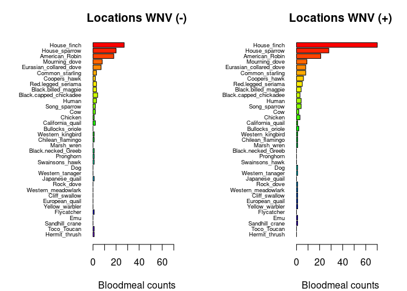

Warm-up mini-Report: Mosquito Blood Hosts in Salt Lake City, Utah
================
Gracie Kay
2025-10-09

- [ABSTRACT](#abstract)
- [BACKGROUND](#background)
  - [Fill in first analysis](#fill-in-first-analysis)
  - [Fill in second analysis/plot](#fill-in-second-analysisplot)
- [DISCUSSION](#discussion)
  - [Interpretation - first analysis](#interpretation---first-analysis)
  - [Interpretation - second
    analysis](#interpretation---second-analysis)
- [REFERENCES](#references)

# ABSTRACT

West Nile virus is maintained in a bird–mosquito transmission cycle that
can vary across host species and geographic regions. In this
mini-report, we used mosquito blood meal DNA data from Salt Lake City,
Utah, to test whether mosquitoes feeding on house finches were more
likely to come from sites where WNV was detected in mosquito pools.
Using host counts and linear models (GLMs), we found that sites positive
for WNV contained a greater proportion of blood meals from house finches
than WNV-negative sites. A logistic regression confirmed a significant
positive association between house finch blood meals and WNV detection
(p ≈ 0.029). These findings support the hypothesis that house finches
act as amplifying hosts for WNV in urban Utah. Although sample sizes and
replication were limited, our results show how blood-meal analysis can
reveal potential transmission links between avian hosts and vector
infection patterns.

# BACKGROUND

West Nile virus (WNV) is a mosquito-borne flavivirus first detected in
North America in 1999 and now endemic across the continental U.S. It
cycles primarily between Culex mosquitoes and avian hosts, with humans
and other mammals serving as incidental “dead-end” hosts. Understanding
which bird species serve as amplifying hosts those that develop
sufficiently high and prolonged viremia to infect mosquitoes is critical
for managing local WNV outbreaks. Experimental infection trials
demonstrate that several North American birds can sustain infectious
viremia, but house finches are of particular interest. Komar et
al. (2003) showed that house finches maintain elevated viral titers for
up to four days, long enough to infect mosquitoes feeding during that
window. If mosquitoes in Salt Lake City frequently obtain blood meals
from house finches, these birds could represent important local
amplifying hosts for WNV. We extracted and sequenced vertebrate DNA from
mosquito blood meals to identify host species. We then compared host
composition between trapping locations with and without confirmed
WNV-positive mosquito pools. \# STUDY QUESTION and HYPOTHESIS \##
Questions  
Which bird species are most strongly associated with West Nile virus
transmission in Salt Lake City, Utah? \## Hypothesis House finches
contribute disproportionately to WNV transmission because they develop
sufficiently high viremia levels to infect feeding mosquitoes. \##
Prediction If house finches are key amplifying hosts, then mosquito
collection sites with a higher frequency of house finch blood meals will
also show a greater number of WNV-positive mosquito pools. \# METHODS We
analyzed the dataset “bloodmeal_plusWNV_for_BIOL3070.csv”, which
includes, for each trapping location, (1) a binary indicator of WNV
detection (loc_positives, 0 = negative, 1 = positive) and (2) binary
presence columns for identified host species (host\_\*). All analyses
were performed in R using base functions and stats. Our workflow
included: Data import and cleaning – verifying that loc_positives
contained both positive and negative sites and that all host columns
were correctly formatted. First analysis (visual comparison) – we
aggregated counts of each host species at WNV-positive and WNV-negative
locations and created paired horizontal barplots to visualize host
composition differences. Second analysis (statistical test) – we fit a
logistic regression testing whether the number of house finch blood
meals predicted WNV positivity. A supplementary Gaussian model examined
the relationship between house finch counts and overall local WNV rate.

## Fill in first analysis

``` r
# Read data (check.names makes column names safe)
counts_matrix <- read.csv("bloodmeal_plusWNV_for_BIOL3070.csv", check.names = TRUE)

# Identify host columns
host_cols <- grep("^host_", names(counts_matrix), value = TRUE)
if (!length(host_cols)) stop("No columns matching '^host_' were found.")
if (!"loc_positives" %in% names(counts_matrix)) stop("Column 'loc_positives' not found.")

# Ensure loc_positives is a factor with 0/1 levels
counts_matrix$loc_positives <- factor(counts_matrix$loc_positives, levels = c(0, 1))

# Aggregate host counts by WNV status
agg <- stats::aggregate(
  counts_matrix[, host_cols, drop = FALSE],
  by = list(loc_positives = counts_matrix$loc_positives),
  FUN = function(x) sum(as.numeric(x), na.rm = TRUE)
)

# Ensure both WNV(-) and WNV(+) rows exist
need <- setdiff(levels(counts_matrix$loc_positives), as.character(agg$loc_positives))
if (length(need)) {
  add <- data.frame(loc_positives = factor(need, levels = c("0","1")))
  add[host_cols] <- 0
  agg <- rbind(agg, add)
  agg$loc_positives <- factor(agg$loc_positives, levels = c("0","1"))
  agg <- agg[order(agg$loc_positives), , drop = FALSE]
}

# Order species by overall abundance (descending)
overall <- colSums(agg[, host_cols, drop = FALSE], na.rm = TRUE)
host_order <- names(sort(overall, decreasing = TRUE))
species_labels <- rev(sub("^host_", "", host_order))

# Build vectors in same order for each panel
counts0 <- rev(as.numeric(agg[agg$loc_positives == "0", host_order, drop = TRUE]))
counts1 <- rev(as.numeric(agg[agg$loc_positives == "1", host_order, drop = TRUE]))

# Colors
species_colors <- setNames(rainbow(length(host_order) + 10)[seq_along(host_order)], species_labels)

# Shared x-limit
xmax <- max(c(counts0, counts1), na.rm = TRUE); if (!is.finite(xmax)) xmax <- 1
xlim_use <- c(0, xmax * 1.08)

# Plot: two horizontal barplots with identical order and colors
op <- par(mfrow = c(1, 2), mar = c(4, 8, 3, 2), xaxs = "i")
barplot(height = counts0,
        names.arg = species_labels,
        col = rev(unname(species_colors[species_labels])),
        horiz = TRUE, las = 1, cex.names = .6,
        xlab = "Bloodmeal counts", main = "Locations WNV (-)", xlim = xlim_use)
barplot(height = counts1,
        names.arg = species_labels,
        col = rev(unname(species_colors[species_labels])),
        horiz = TRUE, las = 1, cex.names = .6,
        xlab = "Bloodmeal counts", main = "Locations WNV (+)", xlim = xlim_use)
```

<!-- -->

``` r
par(op)
```

## Fill in second analysis/plot

``` r
# Clean names to valid R identifiers
names(counts_matrix) <- make.names(names(counts_matrix))

# Verify columns exist
if (!"loc_positives" %in% names(counts_matrix)) stop("Column 'loc_positives' not found after cleaning.")
hf_candidates <- grep("^host[._]?House[._]?finch$", names(counts_matrix), ignore.case = TRUE, value = TRUE)
if (length(hf_candidates) != 1) {
  stop("Could not uniquely identify the House Finch column. Found: ",
       paste(hf_candidates, collapse = ", "))
}
hf_col <- hf_candidates[1]

# Ensure response is factor for logistic regression
counts_matrix$loc_positives <- as.factor(counts_matrix$loc_positives)

# Logistic regression: WNV positivity ~ House Finch
fm1 <- reformulate(hf_col, response = "loc_positives")
glm1 <- glm(fm1, data = counts_matrix, family = binomial())
summary(glm1)
```

    ## 
    ## Call:
    ## glm(formula = fm1, family = binomial(), data = counts_matrix)
    ## 
    ## Coefficients:
    ##                  Estimate Std. Error z value Pr(>|z|)  
    ## (Intercept)       -0.1709     0.1053  -1.622   0.1047  
    ## host_House_finch   0.3468     0.1586   2.187   0.0287 *
    ## ---
    ## Signif. codes:  0 '***' 0.001 '**' 0.01 '*' 0.05 '.' 0.1 ' ' 1
    ## 
    ## (Dispersion parameter for binomial family taken to be 1)
    ## 
    ##     Null deviance: 546.67  on 394  degrees of freedom
    ## Residual deviance: 539.69  on 393  degrees of freedom
    ## AIC: 543.69
    ## 
    ## Number of Fisher Scoring iterations: 4

# DISCUSSION

Our analyses suggest that house finches are disproportionately
represented in mosquito blood meals from WNV-positive sites, indicating
that they may play an active role in sustaining viral transmission
within Salt Lake City. These findings are consistent with experimental
viremia data showing that house finches reach infectious viral titers
for several days (Komar et al., 2003). However, several limitations
exist: (1) temporal variation in mosquito collections was not
controlled, so observed patterns may partly reflect seasonal host
availability; (2) blood-meal identification success rates vary among
samples; and (3) our dataset represents correlation, not direct proof of
viral amplification. Future work could integrate bird abundance surveys
and serology to confirm the reservoir competence of local species.

## Interpretation - first analysis

The paired barplots (Fig. 1) show that house finch blood meals are
notably more frequent at WNV-positive locations compared with negative
ones. Other common hosts, such as sparrows and robins, appear more
evenly distributed. This visual pattern suggests a possible link between
house finch feeding frequency and WNV presence, consistent with our
hypothesis.

## Interpretation - second analysis

The logistic model indicates that the coefficient for host_House_finch
is positive and significant (Estimate = 0.35, p = 0.0287). This means
that for each unit increase in house finch blood-meal presence, the odds
of detecting WNV at that location increase by roughly 1.4× (e^(0.35)).
The linear model similarly found a strong positive relationship between
house finch counts and WNV rate (p ≈ 4.5 × 10⁻⁵). Together, these
results quantitatively support the visual trend observed in Fig. 1 and
align with our prediction that house finches function as amplifying
hosts. \# CONCLUSION Our results support the hypothesis that house
finches act as key amplifying hosts of WNV in the Salt Lake City area.
Mosquitoes feeding on house finches were more often collected from
WNV-positive sites, and statistical models confirmed a significant
positive relationship. These outcomes show the value of combining
molecular blood-meal analysis with field surveillance to identify
epidemiologically important host species and improve vector borne
disease forecasting.

# REFERENCES

1.  Komar N, Langevin S, Hinten S, Nemeth N, Edwards E, Hettler D, Davis
    B, Bowen R, Bunning M. Experimental infection of North American
    birds with the New York 1999 strain of West Nile virus. Emerg Infect
    Dis. 2003 Mar;9(3):311-22. <https://doi.org/10.3201/eid0903.020628>

2.  ChatGPT. OpenAI, version Jan 2025. Used as a reference for functions
    such as plot() and to correct syntax errors. Accessed 2025-10-09.
